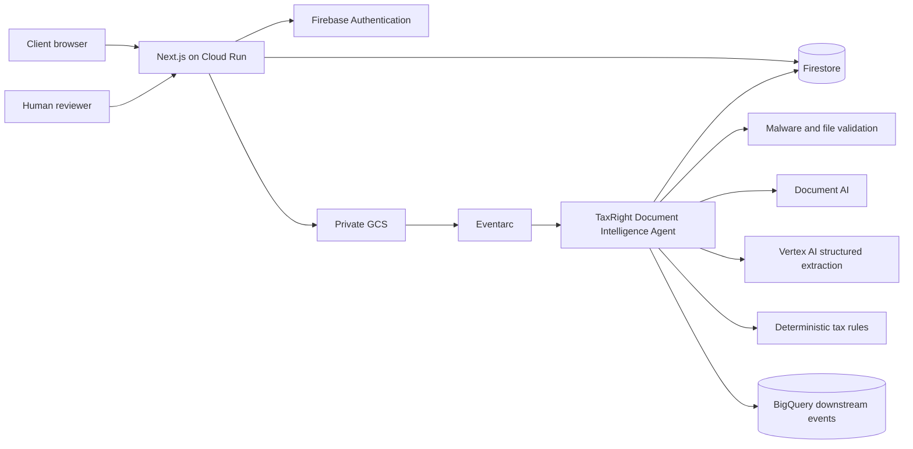
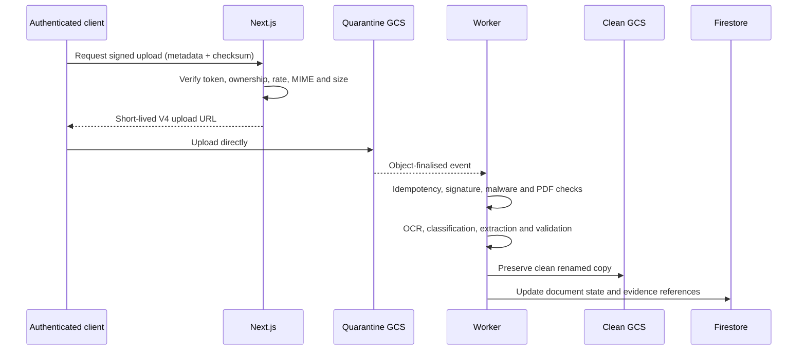
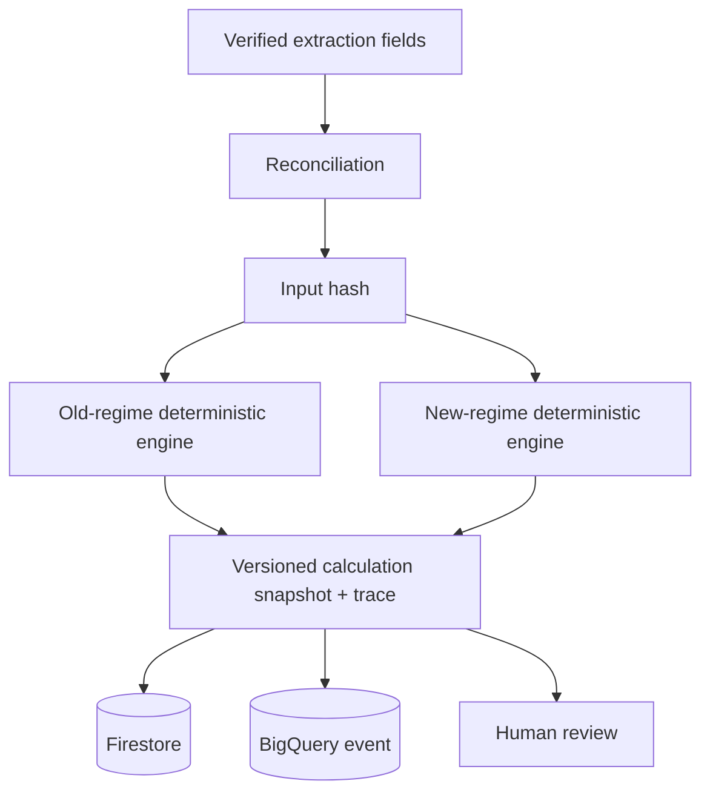
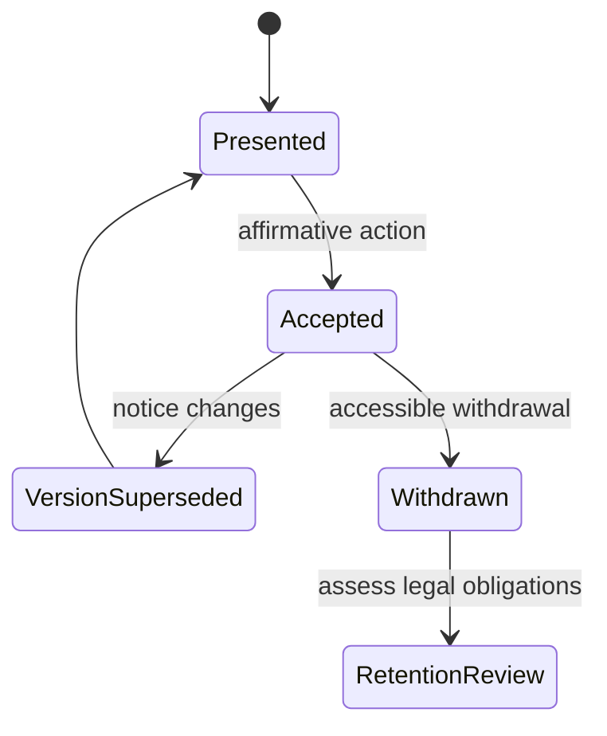
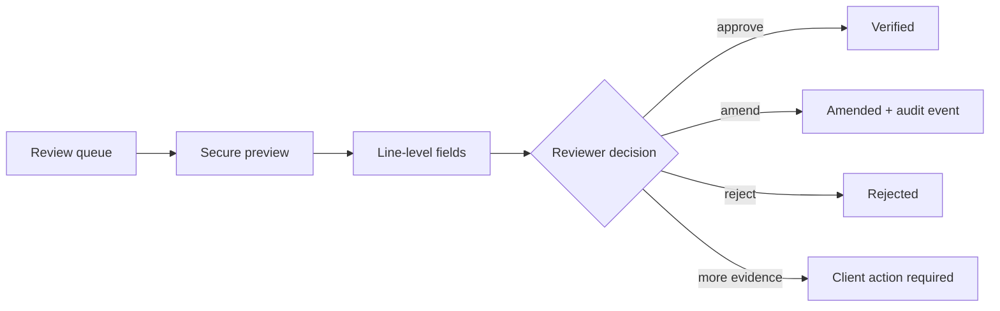
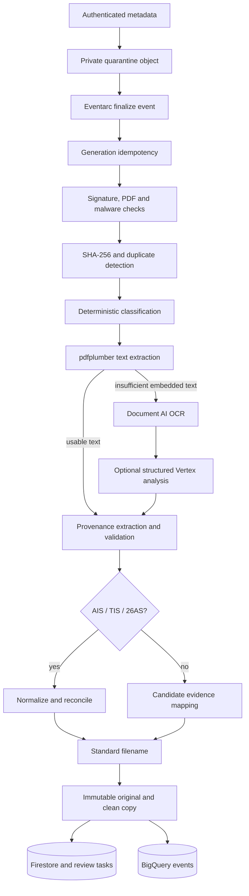

# TaxRight AI Architecture

## Application

## Upload pipeline

## Tax calculation pipeline

## Consent lifecycle

## Staff review

## Trust boundaries

- Browser input, file metadata, uploaded bytes, OCR text, and AI output are untrusted.
- Browser never receives service-account credentials, bucket paths, raw PAN indices, or BigQuery access.
- Next.js verifies Firebase tokens and case ownership for every protected request.
- Worker identities are separate from web identities and receive only bucket/collection permissions needed for their tasks.
- Existing income-tax and trust-document storage is read-only reference data and is not copied into development.

## Document Intelligence Agent

The agent has no credential-vault, e-Filing password, OTP, EVC, or filing-session
access. AIS password candidates may only come from versioned verified conventions,
are derived in memory, and are never logged or persisted. The convention list starts
empty and fails closed.
